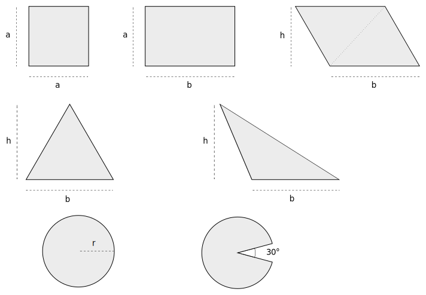

# Area

### Paralellogram

$$ A = b \cdot h $$

Kvadrater och rektanglar är bara specialfall av paralellogram. På
bilden har rektangeln och den "tiltade" (en. skewed) rektangeln samma area.

### Trianglar

$$ A = \frac{b \cdot h}{2} $$

Formen på triangeln spelar ingen roll, har du $b$ och
$h$ så stämmer formeln. På bilden har båda trianglarna samma area.

### Cirklar

$$ A = r^2 \cdot \pi $$

### Uppgifter

* "Bevisa" för dig själv att formeln för paralellogramet stämmer genom
  att dela in det i 2 likadana trianglar

* Beräkna arean för "pacman" om $r = 2 cm$

(facit)

$$
A = \frac{b \cdot h}{2} + \frac{b \cdot h}{2} = b \cdot h
$$

Ta arean av hela cirkeln minus "tårtbiten"
$$ A = 2^2 \cdot \pi - 2^2 \cdot \pi \cdot \frac{30}{360} = 4 \pi -  \frac{4 \pi}{12} =  \frac{4 \pi \cdot 11}{12} = \frac{44 \pi}{12} \approx 11.52 \text{ cm}^2 $$

## Bevis

[Bevis](https://sv.wikipedia.org/wiki/Matematiskt_bevis)
är något av det viktigaste sm finns inom matematiken - *allt* måste
bevisas för att kunna användas. Men man måste ha några grundsatser,
dessa kallas [axiom](https://sv.wikipedia.org/wiki/Axiom).
Enl. Wikipedia är axiom "ett självklart påstående vars sanningshalt
inte kan betvivlas". I uppgiften ovan fick du ta formeln för triangeln
som axiom, det är inte rätt sätt egentligen men funkar i uppgiften.
