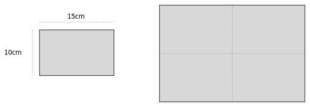

# Scaling in 2 dimensions

Scaling is to multiply the objects' dimensions with a factor $N$.
If N > 1 the object will be larger and with N < 1 smaller.

## What happens with circumference and area when scaling?

The rectangle is scaled by 2 (it's dimensions are doubled).

* How much longer is the circumference (omkrets)?

* How much larger is the area?

* Same questions if the rectangle is scaled by 3 (draw a picture)

* Same questions if the rectangle is scaled by $N$?
  Invent a formula. Use $a$=original area, $c$=original circumference,
  $A$=scaled area, $C$=scaled circumference.

In this figure the star is scaled by 2.

* Do you think your formula works for the star? That is, is you
  formula generic?

* Lars is moving the lawn on a 25x25m area. A neighbor says "Can you
  move my lawn? It's double the size 50x50m, but I tripple the money!"
  Should he accept?

(answer)

When the rectangles dimensions are doubled the circumference is also
doubled but the area becomes 4 times larger.

If the rectangle is scaled by 3 the circumference becomes 3 times
longer as well, but the area becomes 9 times larger.

Formula;

$C = N \cdot c$

$A = N \cdot N \cdot a$

Or;

$A = N^2 \cdot a$

And yes, *the formula is generic*. It works for *any* 2-dimensional shape.

No! It will take 4 times as long to move the lawn on a 50x50m area.

