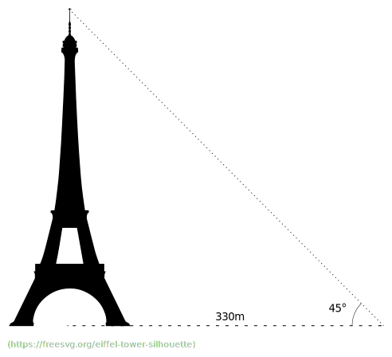

# Triangulering grunder

Triangulering ([läs mer](https://sv.wikipedia.org/wiki/Triangulering))
har använts i tusentals år och används fortfarande. Triangulering
används tex inom lantmäteri (göra
[topografiska](https://sv.wikipedia.org/wiki/Topografi) kartor) och
för att mäta avstånd.

I triangulering används *trigonometri* (sin, cos) men man kan komma en
bra bit med likformighet.

* Hur högt är Eiffeltornet?

(facit)

330m

### Fun facts

Eratosthenes använde en variant av triangulering för att [mäta jordens
omkrets](https://sv.wikipedia.org/wiki/Eratosthenes) på 200-talet
f.kr. Alltså innan den kristna kyrkan bestämt att jorden var platt.

Inom lantmäteriet användes ett instrument för att mäta vinklar med
stor precision som kallas [teodolit](https://en.wikipedia.org/wiki/Theodolite).
