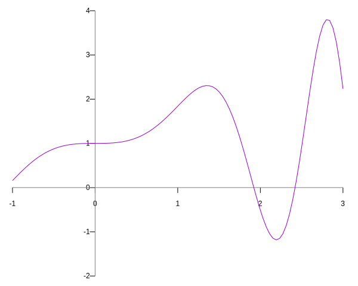
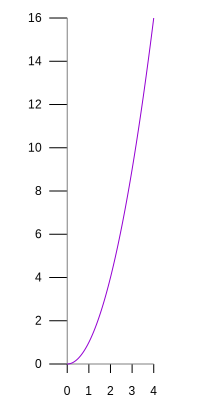
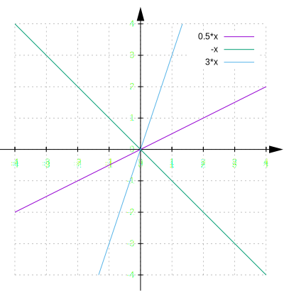
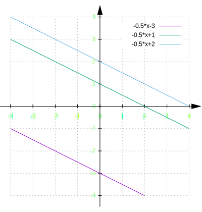
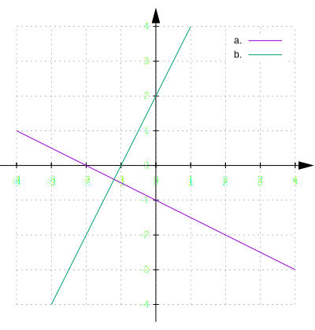

# Grafer

Grafer är *mycket viktiga* inom matematik och statistik för att
visualisera ett problem.
Det finns många verktyg för att göra grafer, tex kalkylprogram men
även [online](http://fooplot.com/).

Man använder ett koordinatsystem;


Bilden visar ett [Kartesiskt
koordinatsystem](https://sv.wikipedia.org/wiki/Kartesiskt_koordinatsystem)
som är det vanligaste (men det finns andra). Skärningspunkten mellan
axlarna kallas *origo*. Man kan lägga till en z-axel för att få ett
3-dimensionellt koordinatsystem (som i Minecraft). Oftast anger man $y$
som en *funktion* av $x$, den allmäna formen är då
$y = f(x)$. Funktionerna kan vara mycket komplicerade.

Exempel;
$y = 1 + x \sin x^2$



## Manuell graf

Om vi vill göra en graf för area av en kvadrat med sidan $x$ får vi
$y = x^2 $. Vi börjar med en värdetabell

|  $x$  |  $x^2$ |
| ----- | ------ |
|  0    |  0     |
|  0.5  |  0.25  |
|  1    |  1     |
|  1.5  |  2.25  |
|  2    |  4     |
|  3    |  9     |
|  4    |  16    |

Rita sedan ett koordinatsystem och markera koordinaterna. Förbind
sedan punkterna. Observera att det sällan är raka linjer mellan punkterna.

* Gör en graf mha värdetabellen ovan. Använd rutblock och 1 steg = 1cm.

<details><summary>(facit)</summary>



</details>


## Räta linjens ekvation

Den [räta linjens ekvation](https://sv.wikipedia.org/wiki/Linj%C3%A4r_ekvation)
beskriver en linje i ett koordinatsystem. Formeln är;

$$y = kx + m$$

Vi börjar med att sätta $m = 0$ och ser vad som händer för olika
$k$;



Man kan se att ju högre $k$ desto "brantare" är linjen. Också om
$k < 0$ lutar linjen nedåt.
$k$ kallas för *riktningskoefficient*.

Om vi istället sätter $k = -\frac{1}{2}$ och ändrar
$m$ får vi tex;



Man kan se att $m$ anger var linjen skär y-axeln.
$m$ kallas *konstantterm*.

**Uppgift**: Vad blir det för linje om
$k = 0$ ?

**Uppgift**: Ange formeln för linjerna på formen $y = kx + m$;



<details><summary>(facit)</summary>

För $k = 0$ blir det en linje parallel med X-axeln.


Man räknar ut $k$ enl.

$k = \frac{\Delta y}{\Delta x}$

$\Delta$ är den grekiska bokstaven "delta" och används ofta inom
matamatiken för att beteckna en ökning (eller minskning).

a. $y = - \frac{1}{2} - 1$

b. $y = 2 x + 2$

Här syns en viktig egenskap; om produkten $k_a \cdot k_b = -1$ så är
linjerna vinkelräta.

</details>


<hr />
<details><summary>(gnuplot)</summary>

```
gnuplot <<EOF
set terminal svg dynamic
set out 'plot1.svg'
unset y2tics
set key off
set tics axis
set zeroaxis linewidth 1 linetype 1 lc 0
set xtics nomirror
set ytics nomirror
set tics scale 1 1
set border 0
set xrange [-1:3]
unset x2tics
unset x2tics
plot 1 + x * sin(x*x)
EOF

gnuplot <<EOF
set terminal svg size 200,400 dynamic
set out 'sqarea.svg'
unset y2tics
set key off
set tics axis
set zeroaxis linewidth 1 linetype 1 lc 0
set xtics nomirror
set ytics nomirror
set xtics scale 1 1
set ytics scale 2 2 offset -2
set size ratio -1
set border 0
set xrange [0:4]
unset x2tics
plot x*x
EOF

gnuplot <<EOF
set terminal svg size 400,420 dynamic
set out 'lines1.svg'
#set terminal wxt 0 enhanced size 400,420
set xrange [-4:4]
set yrange [-4:4]
set size ratio -1
set border 0
unset x2tics
unset y2tics
#set zeroaxis linewidth 1 linetype 1 lc 0 dt 2
#set tics axis
set arrow 1 from -4.5,0 to 4.5 filled
set arrow 2 from  0,-4.5 to 0,4.5 filled
set tics 2 1 textcolor bgnd axis scale 0.4
set grid
plot 0.5*x, -x, 3*x
EOF

gnuplot <<EOF
set terminal svg size 400,420 dynamic
set out 'lines2.svg'
#set terminal wxt 0 enhanced size 400,420
set xrange [-4:4]
set yrange [-4:4]
set size ratio -1
set border 0
unset x2tics
unset y2tics
#set zeroaxis linewidth 1 linetype 1 lc 0 dt 2
#set tics axis
set arrow 1 from -4.5,0 to 4.5 filled
set arrow 2 from  0,-4.5 to 0,4.5 filled
set tics 2 1 textcolor bgnd axis scale 0.4
set grid
plot -0.5*x-3, -0.5*x+1, -0.5*x+2
EOF

gnuplot <<EOF
set terminal svg size 400,420 dynamic
set out 'lines3.svg'
#set terminal wxt 0 enhanced size 400,420
set xrange [-4:4]
set yrange [-4:4]
set size ratio -1
set border 0
unset x2tics
unset y2tics
#set zeroaxis linewidth 1 linetype 1 lc 0 dt 2
#set tics axis
set arrow 1 from -4.5,0 to 4.5 filled
set arrow 2 from  0,-4.5 to 0,4.5 filled
set tics 2 1 textcolor bgnd axis scale 0.4
set grid
plot -0.5*x-1 title "a.", 2*x+2 title "b."
EOF

# A shadowed section
gnuplot <<EOF
set xrange [0:2.5]
set xtics nomirror
set ytics nomirror
f(x) = x
set size ratio -1
set border 0
set zeroaxis linewidth 1 linetype 1 lc 0
set style fill transparent solid 0.08
set style line lc black
set arrow from 2,0 to 2,2 nohead lw 1 dt 2
filter(x,min,max) = (x >= min && x <= max) ? x : 1/0
plot '+' using (filter($1, 0, 2)):(f($1)) with filledcurves x1 lt 0 lw 0 lc 0 notitle,\
     ''  using 1:(f($1)) with lines lw 1 lt 1 lc 0 notitle
plot '+' using (filter($1, 0, 2)):(f($1)) with filledcurves x1 lt 0 lw 0 lc 0 notitle,\
     f(x) with lines lw 1 lt 1 lc 0 notitle
EOF
```

</details>

